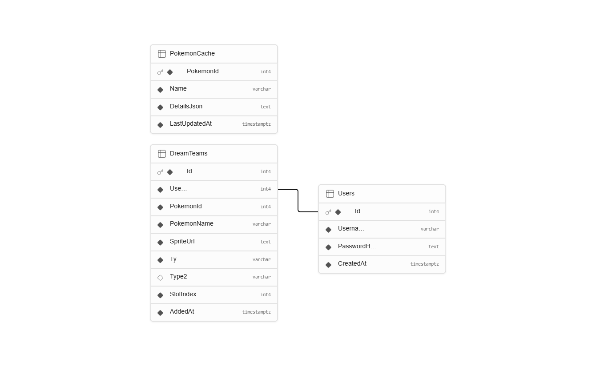
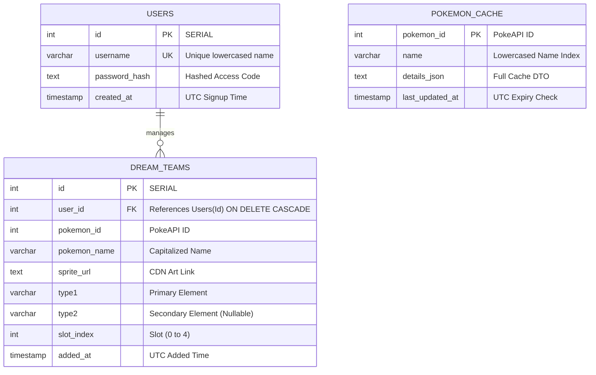

# Supabase Database Setup Guide: Pokemon Trainer Portal

This guide provides step-by-step instructions to set up your PostgreSQL database on Supabase using your GitHub account, compile the tables, and link them to your ASP.NET Core backend.

---

## 1. Step-by-Step Supabase Setup

### Step 1: Login and Create Project
1. Open [Supabase.com](https://supabase.com) in your browser.
2. Click **Sign In** and select **Continue with GitHub** to log in using your GitHub account.
3. On your dashboard, click the green **New Project** button.
4. Select your Organization, then enter the project details:
   * **Name**: `pokemon-trainer-portal`
   * **Database Password**: *Generate a secure password and save it somewhere safe.*
   * **Region**: Select the region closest to you (e.g., `West Europe` or `US East`).
5. Click **Create new project**. Wait 1–2 minutes for the database to provision.

### Step 2: Open the SQL Editor
1. Once the project dashboard loads, look at the left sidebar menu.
2. Click on the **SQL Editor** icon (represented by `SQL` or a terminal icon).
3. Click **New query** (or **New Blank Query**) to open an editor window.

### Step 3: Run the Schema Script
1. Copy the entire SQL script from Section 3 below.
2. Paste it into the SQL editor window.
3. Click the **Run** button (or press `Ctrl + Enter` / `Cmd + Enter`).
4. You should see a message saying **"Success. No rows returned"** or listing the created tables.

---

## 2. Entity-Relationship & Tables Chart

The database is structured to enforce strong relational constraints, prevent duplicate team members, and ensure indexes exist for fast search caching.

### Visual Database Schema
Below is the database schema diagram exported from the active Supabase instance:



### Database ER Diagram (Mermaid)



### Table Definitions

#### 1. `Users` Table
Holds trainer registration data.
| Column | Data Type | Constraints | Description |
| :--- | :--- | :--- | :--- |
| `Id` | `SERIAL` (int) | `PRIMARY KEY` | Auto-incrementing identifier. |
| `Username` | `VARCHAR(100)` | `UNIQUE`, `NOT NULL` | Trainer name (e.g., `alon`). Unique index enforced. |
| `PasswordHash` | `TEXT` | `NOT NULL` | PBKDF2 hashed salt + hash value. |
| `CreatedAt` | `TIMESTAMPTZ` | `DEFAULT NOW()` | Date and time the account was created. |

#### 2. `DreamTeams` Table
Stores custom teams of up to 5 Pokémon per trainer.
| Column | Data Type | Constraints | Description |
| :--- | :--- | :--- | :--- |
| `Id` | `SERIAL` (int) | `PRIMARY KEY` | Unique record identifier. |
| `UserId` | `INT` | `FOREIGN KEY` | References `Users(Id)` with `ON DELETE CASCADE`. |
| `PokemonId` | `INT` | `NOT NULL` | ID of the Pokémon in the Pokédex (1 to 151). |
| `PokemonName`| `VARCHAR(100)` | `NOT NULL` | The name of the Pokémon. |
| `SpriteUrl` | `TEXT` | `NOT NULL` | URL to the artwork asset. |
| `Type1` | `VARCHAR(50)` | `NOT NULL` | Primary element type. |
| `Type2` | `VARCHAR(50)` | `NULLABLE` | Secondary element type (if dual-type). |
| `SlotIndex` | `INT` | `CHECK (0..4)` | Represents team slot position. |
| `AddedAt` | `TIMESTAMPTZ` | `DEFAULT NOW()` | Timestamp when added to the team. |

> [!IMPORTANT]
> **Enforced Integrity Constraints**:
> * **No Duplicates**: `UNIQUE("UserId", "PokemonId")` ensures a trainer cannot add the same Pokémon twice to their team.
> * **No Slot Overlaps**: `UNIQUE("UserId", "SlotIndex")` ensures a trainer cannot put multiple Pokémon in the same slot.
> * **Slot Bounds**: `CHECK ("SlotIndex" >= 0 AND "SlotIndex" < 5)` restricts teams to exactly 5 members.

#### 3. `PokemonCache` Table
Acts as a server-side cache proxy for PokeAPI query responses.
| Column | Data Type | Constraints | Description |
| :--- | :--- | :--- | :--- |
| `PokemonId` | `INT` | `PRIMARY KEY` | The Pokédex ID. |
| `Name` | `VARCHAR(100)` | `NOT NULL` | Lowercased search index. |
| `DetailsJson` | `TEXT` | `NOT NULL` | Serialized Pokémon details JSON object. |
| `LastUpdatedAt`| `TIMESTAMPTZ` | `DEFAULT NOW()` | Used to refresh cache records older than 24 hours. |

---

## 3. SQL Setup Script

Copy and run the following script in your **Supabase SQL Editor**:

```sql
-- 1. Create Users Table
CREATE TABLE IF NOT EXISTS "Users" (
    "Id" SERIAL PRIMARY KEY,
    "Username" VARCHAR(100) NOT NULL,
    "PasswordHash" TEXT NOT NULL,
    "CreatedAt" TIMESTAMPTZ NOT NULL DEFAULT NOW()
);

-- Enforce case-insensitive unique usernames
CREATE UNIQUE INDEX IF NOT EXISTS "IX_Users_Username_Lower" ON "Users" (LOWER("Username"));

-- 2. Create PokemonCache Table
CREATE TABLE IF NOT EXISTS "PokemonCache" (
    "PokemonId" INT PRIMARY KEY,
    "Name" VARCHAR(100) NOT NULL,
    "DetailsJson" TEXT NOT NULL,
    "LastUpdatedAt" TIMESTAMPTZ NOT NULL DEFAULT NOW()
);

-- Index on name for fast lookups
CREATE INDEX IF NOT EXISTS "IX_PokemonCache_Name" ON "PokemonCache" ("Name");

-- 3. Create DreamTeams Table
CREATE TABLE IF NOT EXISTS "DreamTeams" (
    "Id" SERIAL PRIMARY KEY,
    "UserId" INT NOT NULL,
    "PokemonId" INT NOT NULL,
    "PokemonName" VARCHAR(100) NOT NULL,
    "SpriteUrl" TEXT NOT NULL,
    "Type1" VARCHAR(50) NOT NULL,
    "Type2" VARCHAR(50) NULL,
    "SlotIndex" INT NOT NULL,
    "AddedAt" TIMESTAMPTZ NOT NULL DEFAULT NOW(),
    
    -- Enforce relationships
    CONSTRAINT "FK_DreamTeams_Users_UserId" FOREIGN KEY ("UserId") 
        REFERENCES "Users" ("Id") ON DELETE CASCADE,
        
    -- Check constraint for team slot indices (0 to 4)
    CONSTRAINT "CK_DreamTeams_SlotIndex_Range" CHECK ("SlotIndex" >= 0 AND "SlotIndex" < 5),
    
    -- Enforce no duplicate Pokemon per user team
    CONSTRAINT "UQ_DreamTeams_UserId_PokemonId" UNIQUE ("UserId", "PokemonId"),
    
    -- Enforce no slot overlaps per user team
    CONSTRAINT "UQ_DreamTeams_UserId_SlotIndex" UNIQUE ("UserId", "SlotIndex")
);

-- Optimize queries searching teams by user
CREATE INDEX IF NOT EXISTS "IX_DreamTeams_UserId" ON "DreamTeams" ("UserId");
```

---

## 4. Connecting the Backend to Supabase

1. Double-check your **Supabase Database Settings** for your **Connection String**.
2. Update your `appsettings.json` connection string and database provider toggle.
3. Install PostgreSQL support in your C# backend:
   ```bash
   cd pokemon-backend
   dotnet add package Npgsql.EntityFrameworkCore.PostgreSQL
   dotnet run
   ```
   *The system is now fully hooked up to your Supabase PostgreSQL database cloud instances.*
