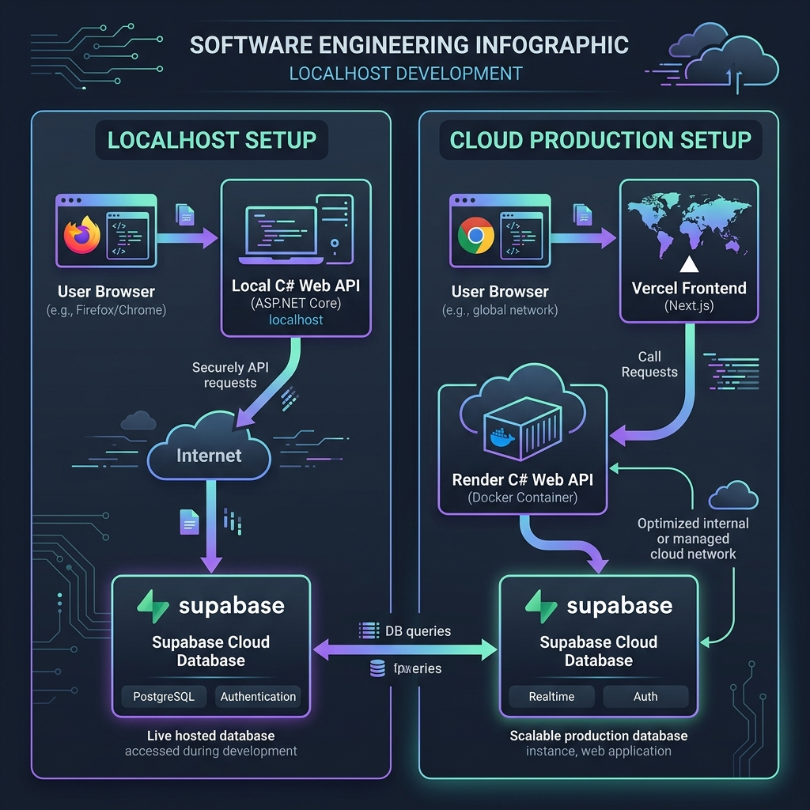
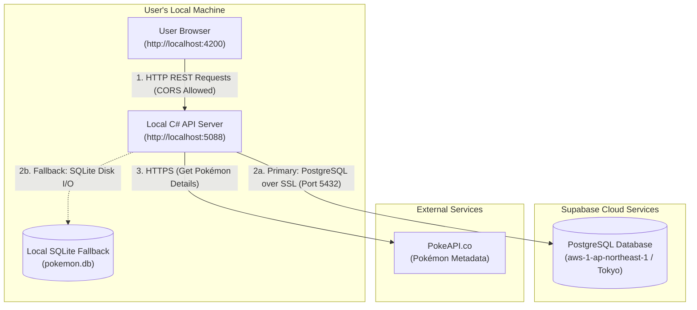
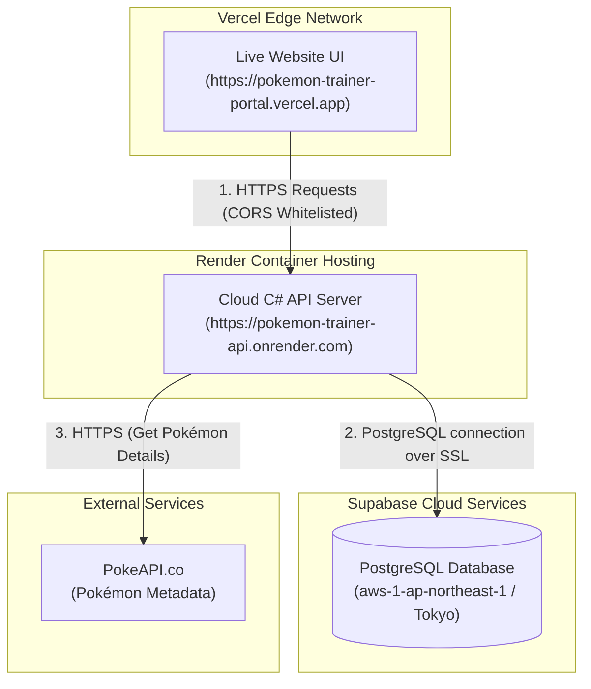

# System Architecture & Deployment Guide: Local vs. Production

This document provides a comprehensive overview of the architecture, data flow, network communication, and environment setups for the **Pokémon Trainer Portal**. 

---

## 1. High-Level Environment Comparison

The application operates in two distinct environments: **Localhost Development** and **Live Cloud Production**. Both environments share the same cloud-hosted PostgreSQL database on Supabase (located in Tokyo, Japan). This unified database ensures that any registration or team edits performed locally are instantly visible on the cloud deployment, and vice-versa.

| Component / Layer | Localhost (Development) | Cloud Production (Live) | Description / Role |
| :--- | :--- | :--- | :--- |
| **Frontend UI** | `http://localhost:4200` | `https://pokemon-trainer-portal.vercel.app` | Angular 21 (Standalone) client interface. |
| **Backend API** | `http://localhost:5088` | `https://pokemon-trainer-api.onrender.com` | ASP.NET Core 8.0 Web API backend. |
| **Database** | **Supabase PostgreSQL** | **Supabase PostgreSQL** | Cloud-hosted PostgreSQL (`aws-1` Tokyo). |
| **External API** | `https://pokeapi.co/api/v2` | `https://pokeapi.co/api/v2` | Source of truth for Pokémon data. |
| **Development DB Fallback** | Local SQLite (`pokemon.db`) | *None (Supabase Only)* | Automatic SQLite fallback if cloud DB is offline. |

---

## 2. Visual Architecture Schema

Below is the visual system layout mapping out the network boundaries and integration points for both setups.

---

## 3. Detailed Data Flow & Flowcharts

### A. Localhost Development Setup

In the local environment, the client and backend run on your local machine. The backend acts as the gateway to the internet, querying the Supabase database for user profile and team data, and caching metadata fetched from the PokeAPI.

* **CORS Configuration**: The local backend whitelists requests coming from `http://localhost:4200` to allow browsers to communicate with the Web API.
* **Database Fallback**: If the local machine lacks internet access or Supabase is paused, the C# backend automatically falls back to a local SQLite database (`pokemon.db`) to allow offline development.

---

### B. Cloud Production Setup

In the cloud setup, there are no local dependencies. The frontend is hosted on Vercel's global CDN edge network, and the backend is deployed as a Docker container on Render. The database remains securely hosted on Supabase in Tokyo.

* **CORS Configuration**: The Render backend explicitly whitelists the Vercel origin `https://pokemon-trainer-portal.vercel.app` in `Program.cs` to prevent browser preflight blocks.
* **HTTPS**: All traffic between the browser, Vercel, Render, and Supabase is encrypted using TLS.

---

## 4. Key Deployment Configurations

### Backend (Render Dockerfile)
Render runs the backend by building the custom Dockerfile located at `pokemon-backend/Dockerfile`. The container exposing port `8080` is mapped by Render's routing layer to port `443` (HTTPS) using a custom proxy.

### Frontend (Vercel Integration)
Vercel is linked to the `pokemon-frontend` subfolder. When commits are pushed to the `main` branch:
1. Vercel automatically runs `npm run build` with the configuration set to production.
2. The Angular app uses [environment.prod.ts](pokemon-frontend/src/environments/environment.prod.ts) which points to the Render backend API endpoint (`https://pokemon-trainer-api.onrender.com/api`).

---

## 5. Important Operational Behaviors (Free-Tier Details)

If you share these links with reviewers, testers, or colleagues, please keep the following free-tier mechanics in mind:

### ☕ Render Cold Starts
* **Behavior**: Render spins down the backend container after **15 minutes of inactivity** to save resources.
* **Impact**: While the Vercel frontend loads instantly (due to static edge caching), the first API call (logging in or registering) will take **45 to 60 seconds** to complete as Render wakes up the backend. Subsequent requests are lightning-fast.
* **Pro-Tip**: Open the backend health check URL (`https://pokemon-trainer-api.onrender.com`) in your browser to wake the service up 1 minute before sending the test link to anyone.

### 💤 Supabase Database Auto-Pause
* **Behavior**: Supabase automatically pauses database instances that receive **no traffic for 7 consecutive days**.
* **Impact**: When paused, login/register attempts will fail with a database timeout.
* **Resolution**: If this happens, log into the [Supabase Dashboard](https://supabase.com/dashboard), select the project `kfcdauuhkllczabnpzta`, and click **Restore Project** (takes about 60 seconds to resume).
